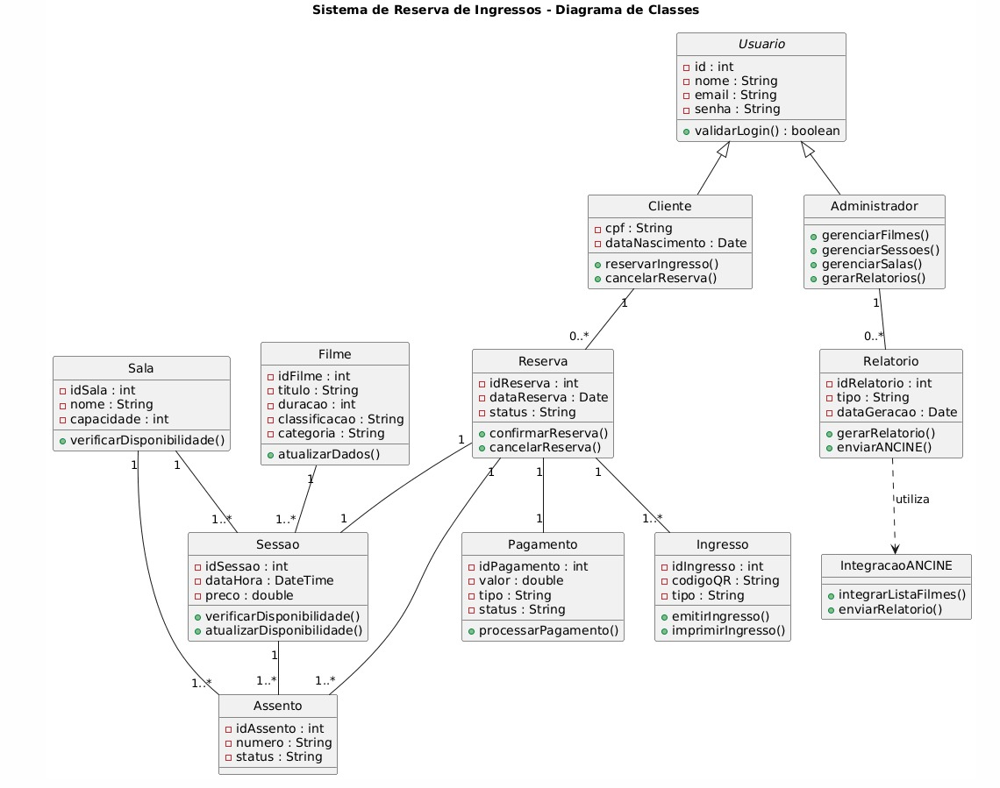

# CASOS DE USO --- SISTEMA DE RESERVA DE INGRESSOS

## Diagrama 

## 👤 Atores

-   **A1 --- Cliente**
-   **A2 --- Administrador**

------------------------------------------------------------------------

# 01 --- Consultar Filmes em Cartaz

**Ator:** A1 --- Cliente\
**Pré-condição:** Sistema disponível e conectado.\
**Pós-condição:** Lista de filmes exibida.

## Fluxo Principal

-   Cliente acessa a opção "Filmes em cartaz".
-   Sistema recupera lista de filmes disponíveis.
-   Sistema exibe filmes com informações e sessões.
-   Cliente seleciona um filme.

## Fluxos Alternativos

-   Nenhum filme disponível.

------------------------------------------------------------------------

# 02 --- Selecionar Sessão

**Ator:** A1 --- Cliente\
**Pré-condição:** Filme selecionado.\
**Pós-condição:** Sessão escolhida.

## Fluxo Principal

-   Cliente visualiza sessões disponíveis.
-   Sistema apresenta horários e salas.
-   Cliente seleciona sessão.
-   Sistema apresenta mapa de assentos.

## Fluxos Alternativos

-   Sessão esgotada.
-   Cliente retorna à lista de filmes.

------------------------------------------------------------------------

# 03 --- Escolher Assento

**Ator:** A1 --- Cliente\
**Pré-condição:** Sessão selecionada.\
**Pós-condição:** Assento selecionado.

## Fluxo Principal

-   Sistema exibe mapa de assentos.
-   Cliente escolhe assento(s).
-   Sistema verifica disponibilidade.
-   Sistema confirma seleção.

## Fluxos Alternativos

-   Assento indisponível.
-   Cliente cancela seleção.

------------------------------------------------------------------------

# 04 --- Reservar Ingresso

**Ator:** A1 --- Cliente\
**Pré-condição:** Assento selecionado.\
**Pós-condição:** Reserva confirmada.

## Fluxo Principal

-   Cliente confirma reserva.
-   Sistema aplica regras de meia-entrada, se necessário.
-   Sistema processa pagamento.
-   Sistema emite ingresso digital.
-   Sistema registra venda.
-   Sistema atualiza disponibilidade.
-   Sistema confirma reserva ao cliente.

## Fluxos Alternativos

-   Cliente utiliza ingresso gratuito de aniversário.
-   Cliente possui benefício de melhores assentos por antecedência.
-   Pagamento recusado.

------------------------------------------------------------------------

# 05 --- Cancelar Reserva

**Ator:** A1 --- Cliente\
**Pré-condição:** Reserva existente.\
**Pós-condição:** Reserva cancelada.

## Fluxo Principal

-   Cliente solicita cancelamento.
-   Sistema verifica política de cancelamento.
-   Sistema cancela reserva.
-   Sistema atualiza disponibilidade.

## Fluxos Alternativos

-   Cancelamento fora do prazo permitido.
-   Falha no processamento de reembolso.

------------------------------------------------------------------------

# 06 --- Processar Pagamento

**Ator:** A1 --- Cliente\
**Pré-condição:** Reserva em andamento.\
**Pós-condição:** Pagamento aprovado ou recusado.

## Fluxo Principal

-   Sistema solicita dados de pagamento.
-   Cliente informa dados.
-   Sistema processa pagamento.
-   Sistema confirma resultado.

## Fluxos Alternativos

-   Pagamento recusado.

------------------------------------------------------------------------

# 07 --- Imprimir Ingresso

**Ator:** A1 --- Cliente\
**Pré-condição:** Ingresso digital emitido.\
**Pós-condição:** Ingresso impresso.

## Fluxo Principal

-   Cliente solicita impressão.
-   Sistema envia ingresso à impressora.
-   Cliente pega ingresso impresso

## Fluxos Alternativos

-   Impressora indisponível.

------------------------------------------------------------------------

# 08 --- Aplicar Regras de Meia-entrada

**Ator:** A1 --- Cliente\
**Pré-condição:** Cliente solicita meia-entrada.\
**Pós-condição:** Desconto aplicado ou negado.

## Fluxo Principal

-   Cliente informa categoria.
-   Sistema valida comprovação.
-   Sistema aplica desconto.

## Fluxos Alternativos

-   Comprovação inválida.
-   Cliente opta por ingresso integral.

------------------------------------------------------------------------

# 09 --- Verificar Disponibilidade

**Ator:** Cliente\
**Pré-condição:** Assento selecionado.\
**Pós-condição:** Assento reservado temporariamente ou rejeitado.

## Fluxo Principal

-   Sistema consulta banco de dados.
-   Sistema confirma disponibilidade.

------------------------------------------------------------------------

# 10 --- Ingresso Gratuito Aniversário

**Ator:** A1 --- Cliente\
**Pré-condição:** Cliente elegível no programa de fidelidade.\
**Pós-condição:** Ingresso emitido sem custo.

## Fluxo Principal

-   Cliente solicita benefício.
-   Sistema valida elegibilidade.
-   Sistema confirma uso.

## Fluxos Alternativos

-   Cliente não elegível.
-   Benefício já utilizado.

------------------------------------------------------------------------

# 11 --- Melhores Assentos Antecedência

**Ator:** A1 --- Cliente\
**Pré-condição:** Compra realizada com até dois dias de antecedência.\
**Pós-condição:** Assentos preferenciais liberados.

## Fluxo Principal

-   Sistema verifica antecedência.
-   Sistema libera assentos premium.

## Fluxos Alternativos

-   Cliente não atende requisito de antecedência.
-   Cliente não é participante do programa.

------------------------------------------------------------------------

# 12 --- Gerenciar Filmes

**Ator:** A2 --- Administrador\
**Pré-condição:** Administrador autenticado.\
**Pós-condição:** Filmes cadastrados ou atualizados.

## Fluxo Principal

-   Administrador acessa painel de filmes.
-   Administrador cadastra, edita ou remove filme.
-   Sistema salva alterações.

## Fluxos Alternativos

-   Dados inválidos.

------------------------------------------------------------------------

# 13 --- Gerenciar Sessões

**Ator:** A2 --- Administrador\
**Pré-condição:** Filmes cadastrados.\
**Pós-condição:** Sessões configuradas.

## Fluxo Principal

-   Administrador define horário e sala.
-   Sistema valida conflitos.
-   Sistema salva sessão.

## Fluxos Alternativos

-   Conflito de horário.

------------------------------------------------------------------------

# 14 --- Gerenciar Salas

**Ator:** A2 --- Administrador\
**Pré-condição:** Administrador autenticado.\
**Pós-condição:** Salas cadastradas.

## Fluxo Principal

-   Administrador configura sala.
-   Sistema salva mapa de assentos.

## Fluxos Alternativos

-   Erro no layout da sala.

------------------------------------------------------------------------

# 15 --- Gerar Relatórios

**Ator:** A2 --- Administrador\
**Pré-condição:** Dados disponíveis.\
**Pós-condição:** Relatórios gerados.

## Fluxo Principal

-   Administrador solicita relatório.
-   Sistema consolida dados.
-   Sistema gera relatório.

## Fluxos Alternativos

-   Dados insuficientes.

------------------------------------------------------------------------

# 16 --- Integrar Lista Oficial ANCINE

**Ator:** A2 --- Administrador\
**Pré-condição:** Integração configurada.\
**Pós-condição:** Lista oficial atualizada.

## Fluxo Principal

-   Sistema consulta API oficial.
-   Sistema importa títulos.

## Fluxos Alternativos

-   Falha na comunicação com serviço externo.

------------------------------------------------------------------------

# 17 --- Relatório por Sessão

**Ator:** A2 --- Administrador\
**Pré-condição:** Sessão finalizada.\
**Pós-condição:** Relatório gerado.

## Fluxo Principal

-   Sistema compila dados.
-   Sistema gera arquivo.

## Fluxos Alternativos

-   Dados inconsistentes.

------------------------------------------------------------------------

#Relatório Consolidado

**Ator:** A2 --- Administrador\
**Pré-condição:** Dados históricos disponíveis.\
**Pós-condição:** Relatório consolidado gerado.

## Fluxo Principal

-   Administrador define período.
-   Sistema consolida informações.

## Fluxos Alternativos

-   Período sem registros.

------------------------------------------------------------------------

# Validar Usuário

**Ator:** A1 --- Cliente\
**Pré-condição:** Tela de login ativa.\
**Pós-condição:** Usuário autenticado ou processo reiniciado.

## Fluxo Principal

-   Sistema solicita senha.
-   Cliente informa senha.
-   Sistema valida senha.
-   Sistema confirma autenticação.

## Fluxos Alternativos

-   Cliente cancela operação (ESC).
-   Senha inválida reinicia processo.

## Diagrama de Classes

