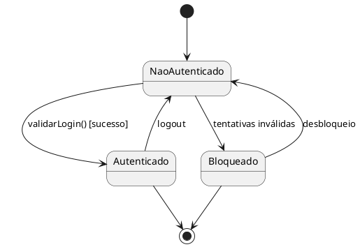

# Diagramas de Estado 

## Classe Usuário 

```plantuml
@startuml
[*] --> NaoAutenticado

NaoAutenticado --> Autenticado : validarLogin() [sucesso]
NaoAutenticado --> Bloqueado : tentativas inválidas

Autenticado --> NaoAutenticado : logout
Bloqueado --> NaoAutenticado : desbloqueio

Autenticado --> [*]
Bloqueado --> [*]
@enduml
```